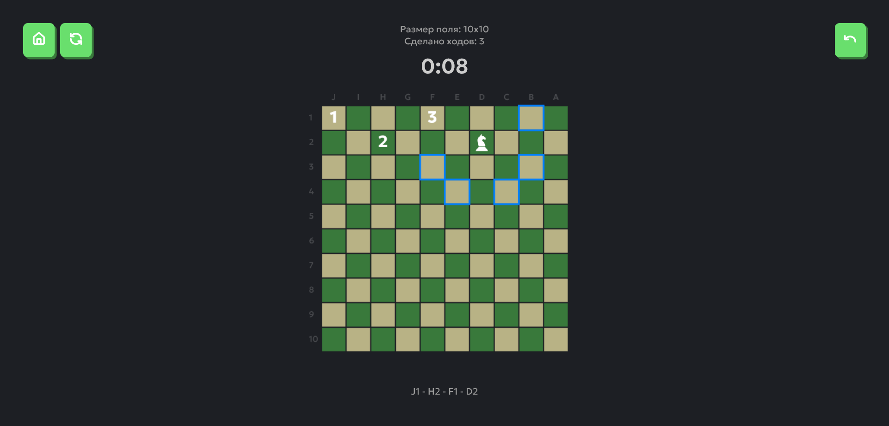

# Атомный Конь - игра

[Тестовое задание](https://github.com/notafavor/test-cases/blob/main/case_3.md) для стажировки в РосАтом.

> ✅ [Демо проекта](https://starpandabeg.github.io/rosatom-test-knight/)



## Правила игры

На игровой доске, подобной шахматной, игрок управляет фигуркой коня.

Конь может ходить буквой "Г": на две клетки в одном направлении и одну в перпендикулярном, или наоборот.

Цель игры - посетить каждую клетку поля только один раз. Доказано, что для любого поля размером 5х5 и выше решение точно есть!

## Функционал

- Доска для игры динамического размера
- Выбор сложности игры - размера доски
- Возможность отмены последнего хода
- История ходов
- Адаптивный интерфейс - хорошо выглядит и на ПК, и на планшете
- Таймер игры

## Использованные технологии и библиотеки

- Angular 18
- Lucide Icons
- TypeScript
- Eslint
- Prettier

## Сборка и запуск

### Отладка

Для запуска приложения в отладочном режиме необходимо:

1. Установить пакеты
   ```bash
   $ npm i
   ```
2. Запустить отладочный сервер
   ```bash
   $ npm start
   ```

Приложение будет доступно по адресу `http://localhost:4200/`. Сервер будет автоматически перезапускаться при любых изменениях в коде.

### Тестирование

Для тестирования используется встроенная в Angular библиотека Jasmine.

```bash
$ npm run test
```

### Развертывание

Для развертывания потребуется Docker. Образ основан на `nginx:1.27-alpine`, использует многоступенчатую сборку для оптимизации процесса.

```bash
$ docker compose up -d --build
```

После сборки приложение будет доступно по адресу `http://localhost:8080/`
